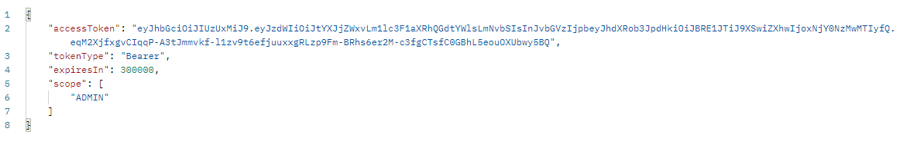

<h1 align="center">
    
</h1>

<h1 align="center">
    
</h1>

# Índice

- [Sobre](#-sobre)
- [Tecnologias utilizadas](#-tecnologias-utilizadas)

## 🔖 Sobre

Este projeto possui como objetivo atuar como um Identity and Access Management (IAM), sendo uma espécie de centralizador de geração de tokens, os quais utilizo em meus projetos que possuem alguma API REST.

---

## 💻 Tecnologias utilizadas

Esta biblioteca foi desenvolvida utilizando a seguinte tecnologia:

- [Kotlin](https://kotlinlang.org)
- [Spring Framework](https://spring.io)
- [Spring Security](https://spring.io/projects/spring-security)

---

<h3 align="center">
  Feito com ❤️ por Leonardo Santana
</h3>
